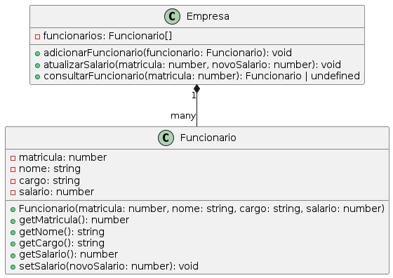

# Sistema de Gerenciamento de Funcionários

## UML


Este projeto implementa um sistema de gerenciamento de funcionários em TypeScript, utilizando conceitos de classes, encapsulamento e tratamento de erros.

## Estrutura do Projeto

- `Funcionario.ts`: Define a classe `Funcionario` com propriedades privadas e métodos públicos para acessar e modificar essas propriedades.
- `Empresa.ts`: Define a classe `Empresa` que gerencia uma lista de funcionários, permitindo adicionar, atualizar salário e consultar funcionários.
- `index.ts`: Contém funções para cadastrar funcionários, atualizar salários e consultar funcionários, além de um exemplo de uso dessas funções.

## Como Executar o Programa

1. Certifique-se de ter o Node.js e o TypeScript instalados em sua máquina.
2. Clone este repositório.
3. Navegue até o diretório do projeto no terminal.
4. Compile os arquivos TypeScript para JavaScript:
   ```sh tsc index.ts```
5. Execute com ```node index.js```