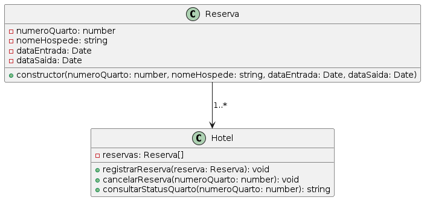

# Sistema de Biblioteca

## Descrição
Este projeto implementa um sistema de gerenciamento de uma biblioteca em TypeScript, utilizando conceitos de classes, encapsulamento e tratamento de erros.

## Estrutura do Projeto

- `Biblioteca.ts`: Define a classe `Biblioteca` com métodos para gerenciar livros.
- `Livro.ts`: Define a classe `Livro` com propriedades e métodos relacionados a um livro.
- `index.ts`: Contém funções para adicionar, remover e listar livros na biblioteca, além de um exemplo de uso dessas funções.

## Diagrama


## Como Executar o Programa

1. Certifique-se de ter o Node.js e o TypeScript instalados em sua máquina.
2. Clone este repositório.
3. Navegue até o diretório do projeto no terminal.
4. Compile os arquivos TypeScript para JavaScript:
   ``` tsc ```
5. Execute o programa:
```node dist/index.js```