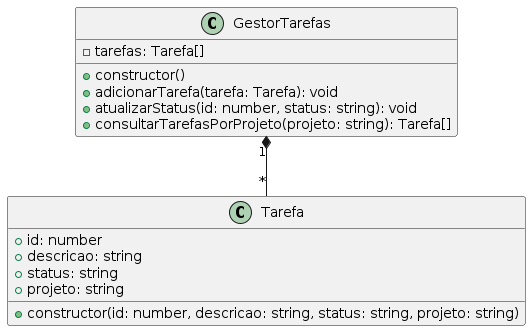

# Sistema de Gestão de Tarefas

## Descrição

Este projeto implementa um sistema simples de gestão de tarefas utilizando TypeScript. O sistema permite:

- **Adicionar Tarefas**: Criação e inclusão de novas tarefas no sistema.
- **Atualizar Status**: Modificação do status de tarefas existentes.
- **Consultar Tarefas por Projeto**: Recuperação e visualização de tarefas pertencentes a um projeto específico.

## Estrutura do Projeto

- **Tarefa.ts**: Define a classe `Tarefa` com propriedades como `id`, `descricao`, `status` e `projeto`.
- **GestorTarefas.ts**: Define a classe `GestorTarefas` responsável por gerenciar a lista de tarefas.
- **index.ts**: Contém funções para testar o sistema, incluindo adição, atualização e consulta de tarefas.
  
## Diagrama



## Como Executar o Programa

1. Certifique-se de ter o Node.js e o TypeScript instalados em sua máquina.
2. Clone este repositório.
3. Navegue até o diretório do projeto no terminal.
4. Compile os arquivos TypeScript para JavaScript:
   ``` tsc ```
5. Execute o programa:
```node dist/index.js```
